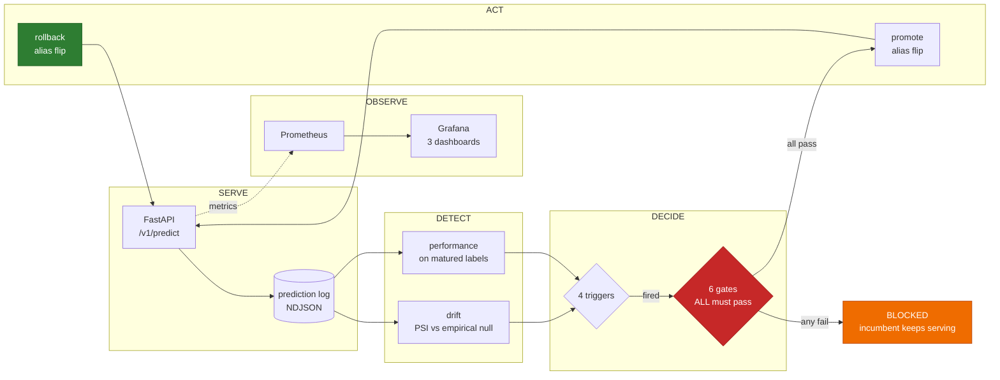
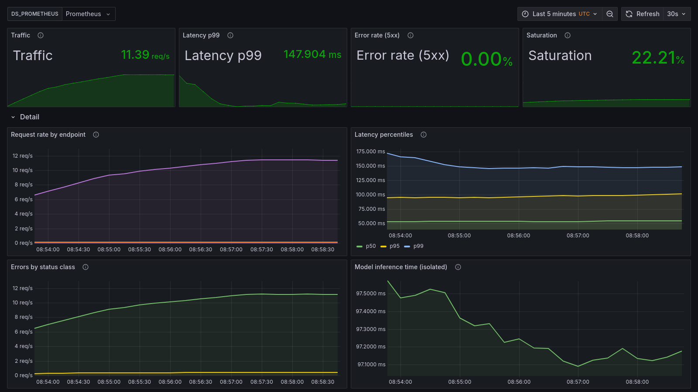
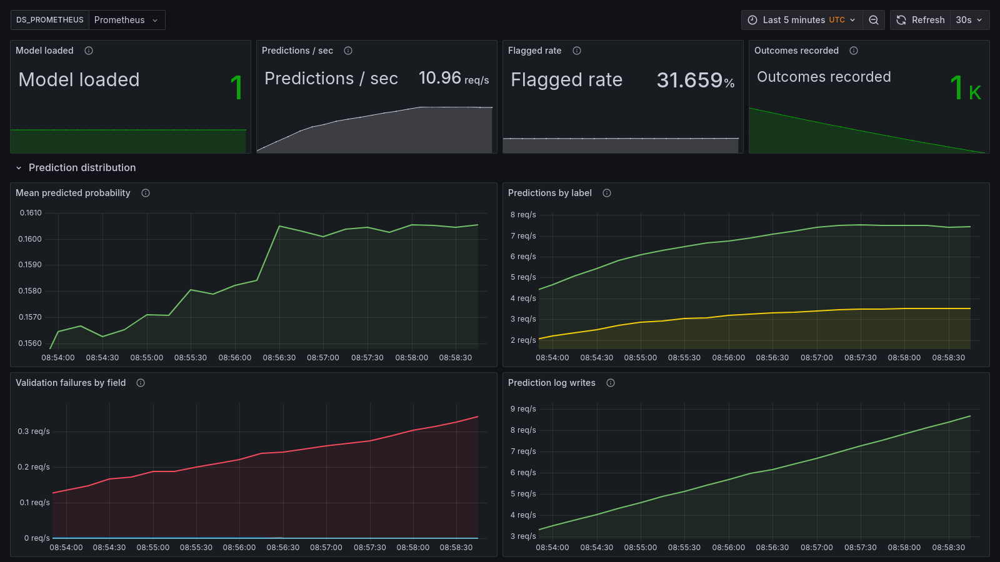
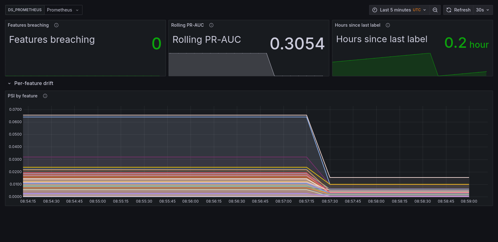

# Credit Default Risk — A Production ML Service

> ## ⚠️ NOT A CREDIT DECISIONING SYSTEM
>
> This is an **engineering demonstration of ML operations**. It is trained on a
> public 2007–2015 dataset from a single lender, has never been validated for
> lending, and has had **no fair-lending or disparate-impact review**. It must
> never be used to decide anyone's access to credit or the price of it.
>
> This disclaimer appears in every API response, the model card and the UI as
> well as here. That repetition is deliberate.

---

## What this project is

Most ML portfolios prove someone can *train* a model. This one exists to prove
something scarcer: that the model can be **operated**.

So the priority is inverted on purpose. The model is deliberately boring — a
calibrated logistic regression — and the operations are the product:
monitoring, drift detection, calibration-gated retraining, canary rollout,
tested rollback, and an incident runbook.

A well-operated logistic regression is a better artifact than an unmonitored
gradient-boosted ensemble. Any effort that would go into squeezing out accuracy
points goes into the observability and retraining layers instead.

### Why credit default

One requirement decided the domain. The project's central control is a
promotion gate that **blocks a challenger which ranks better but calibrates
worse**. That argument only has force where someone acts on the probability
*as a number* — and in credit, the probability is literally the price:

> expected loss = probability of default × exposure × loss given default

A miscalibrated probability is a mispriced loan. The calibration gate stops
being an ethical nicety and becomes the thing protecting the business.

**Lending Club's accepted-loan book:** 2,260,701 loans issued 2007–2018, cut to
**672,379 matured loans, 2007-06 to 2015-12**, with a **14.8%** default rate. It
is real, messy, genuinely imbalanced, and modestly predictable — ROC-AUC near
0.70 is close to the published range for this task. See
[ADR 0003](docs/DECISIONS/0003-dataset-selection.md) for the datasets rejected
and why.

### What the audit found

The [data audit](docs/DATA_AUDIT.md) is generated from code, not written by
hand. Five findings changed the pipeline, and each is a number rather than a
claim:

- **A deterministic leak, demonstrated.** Thirty-one columns are knowable only
  after a loan has run. Training on them reaches **ROC-AUC 0.9983** against an
  honest ceiling near 0.70. Of the 80,312 loans with `recoveries > 0`,
  **100.00%** are defaults — recoveries is money clawed back *after* a default,
  so a non-zero value *is* the label. These columns look like ordinary loan
  attributes, which is exactly why they are dangerous.
- **Right-censoring dominates the recent years.** 40.4% of loans are
  unresolved (38.9% still Current, the rest late or in grace), and the resolved fraction collapses from 100% (2007–2013) to 11.4%
  (2018). The 2018 default rate also *falls* — survivorship among fast
  resolvers, not better lending. Requiring the full term to have elapsed moves
  the positive rate from **0.1998 to 0.1481**: skipping it overstates default
  by 35% relative.
- **The label leaked back in as a feature.** `loan_status` is the column the
  target is derived from, so it predicts it perfectly. It survived the first
  pass because the data dictionary calls it a loan attribute — which it is,
  right up until you make it the label. *Deriving a target creates a leak that
  did not exist before.*
- **33 rows are not loans.** The file ends in export footers — text like
  `"Total amount funded in policy code 1: 6417608175"` sitting in the `id`
  column with every other field empty. They are now removed by a rule that
  names them, rather than vanishing incidentally into the label filter.
- **The problem is genuinely hard.** An unconstrained decision tree, 66 deep
  with 45,210 leaves, scores **1.000 on train and 0.5335 on test**. It memorises
  everything and generalises almost nothing.

---

## The operations loop

The model is one box in this diagram. Everything else is the project.



Two asymmetries in that diagram are deliberate:

- **Triggering is permissive; promoting is strict.** Any one trigger starts a
  retrain, but every gate must pass to ship it. Training a model is cheap and
  reversible; serving one is neither.
- **Rollback is ungated.** Promotion passes six checks; rollback passes none. A
  safety mechanism that can be blocked by the checks it exists to escape is not
  a safety mechanism.

---

## What this proves — with evidence, not claims

### A better-ranking model is refused because it calibrates worse

This is the whole thesis in one command. The challenger below has a **higher
PR-AUC** than the incumbent — most promotion pipelines would ship it:

```console
$ uv run mlservice retrain gates --challenger challenger.json --incumbent champion.json

  BLOCKED  --  blocked by: calibration
        pass  performance    PR-AUC 0.2923 >= 0.2673 (incumbent 0.2723 - 0.005 margin)
        FAIL  calibration    Brier ratio 1.1501 > 1.02 AND ECE 0.0800 > 0.05
        pass  subgroup       worst gap -0.2926 vs incumbent -0.2926 (+0.0% relative, limit +20%)
        pass  behavioral     25/25 behavioural tests passed
        pass  operational    artifact loads and matches the serving contract
        pass  data_quality   training data passed its quality checks
```

A lender prices loans off the probability. A model that ranks borrowers better
but systematically misstates *how likely* each is to default misprices every
loan it touches — while every ranking metric improves.

`promote` then refuses the blocked decision and the serving alias is untouched.
There is deliberately **no `--force`**: a promote command with a bypass is a
promote command with no gates.

### It beats the lender — narrowly, and that is stated

The strongest baseline is not a strawman. `int_rate` is the price Lending Club
set *after running its own underwriting model*, so ranking by it asks whether
this model beats the incumbent lender's judgment:

| | PR-AUC | 95% CI |
|:--|--:|:--|
| Prevalence floor | 0.1471 | — |
| `int_rate` — the lender's own priced risk | 0.2529 | [0.2486, 0.2575] |
| **Champion** | **0.2725** | **[0.2678, 0.2771]** |

Non-overlapping intervals, so the win is real. It is also **0.020** — and part
of the champion's skill is the lender's, because their grade carries the two
largest coefficients in the model. See
[ADR 0009](docs/DECISIONS/0009-lender-grade-as-a-feature.md).

### The fairness finding is in the coefficients, not the footnotes

Four of the ten largest coefficients are `addr_state` dummies. The worst
subgroup recall gap — **−0.293, New Hampshire** — therefore falls on a feature
the model structurally relies on. Geographic risk pricing is exactly the terrain
fair-lending law governs, because location correlates with the protected
characteristics this data deliberately omits.

This model has had no disparate-impact review. The [model card](docs/MODEL_CARD.md)
says so in its fairness section, reports all 59 analysable subgroups, and does
not soften any of them.

### The rollback path is exercised, not asserted

```console
$ uv run mlservice retrain verify-rollback

        seed      -> 1     alias now: 1
        promote   -> 2     alias now: 2
        rollback  -> 1     alias now: 1
  VERIFIED  alias moved 1 -> 2 and back to 1
```

A **required CI check** against a real MLflow registry. It exists in this form
because its first version passed while proving nothing — it promoted the version
already serving and reported `promote 2 → 2, VERIFIED: True`. A verification
that cannot fail is decoration. See
[ADR 0008](docs/DECISIONS/0008-promotion-gates-and-rollback.md).

### Drift thresholds are measured, and they caught our own pipeline

Each of the 64 per-feature thresholds is the **99th percentile of that feature's
PSI between consecutive stable training windows**, clamped to [0.10, 0.25].

Getting that right took two attempts, and the first failure is the more
instructive one. `issue_d` is a date stored as a **string** (`"Dec-2018"`), so
sorting it ordered the windows *alphabetically* — Apr, Aug, Dec, Feb, Jan — and
every threshold was the churn between months adjacent in the alphabet. Nothing
failed. The numbers were plausible, the dashboards were green, and the defect
was only provable by reproducing the recorded PSI values from a lexicographic
sort. Ordering now goes through one function that parses first, and three call
sites can no longer choose the wrong one.

Corrected, four features hit the ceiling — and the interesting column is the
median, not the p99:

| Feature | Median churn | p99 churn | What it is |
|:--|--:|--:|:--|
| `initial_list_status` | 0.0069 | 0.6726 | whole-loan listing introduced, late 2012 |
| `term` | 0.0016 | 0.6169 | **our own maturity rule** |
| `int_rate` | 0.0331 | 0.3339 | repricing, late 2011 |
| `verification_status` | 0.0170 | 0.2644 | income verification tightened, late 2010 |

These features are not "volatile". They are **flat, with one step change each**
— which is what a policy change looks like, and what alphabetical adjacency had
smeared into uniform noise. A single generic threshold either pages on every
step or sleeps through everything else.

**One of the four is not the lender. It is us.** The maturity rule
(`issue_d + term <= observation_end`) censors by term, so 60-month loans stop
at 2013-11 while 36-month loans run to 2015-12. Training data is 13.19%
60-month; every 2015 window is structurally 0.00%. The monitor reported PSI
**1.5738 on `term` in all 32 replay windows** — the identical value every time,
because the gap is fixed by the pipeline rather than by the world.

A permanent alarm carries no information, and this one was actively harmful:
`int_rate`'s genuine 2014-to-2015 repricing was sitting underneath it. `term`
is now excluded from monitoring with its reason, measurement and revisit
condition recorded in config, and every report that omits it says so.

The cost is stated rather than buried: **the model is trained on 60-month loans
and evaluated on a split containing none of them**, so its behaviour on the
longer term is unvalidated. See
[ADR 0007](docs/DECISIONS/0007-drift-thresholds.md) and
[ADR 0010](docs/DECISIONS/0010-term-censoring.md).

---

## It is observable, and the dashboards are real

Three dashboards, generated from `configs/thresholds.yaml` so a panel's red
band cannot drift away from the SLO it represents. Captured through Grafana's
render API rather than by hand — a screenshot taken manually cannot be
reproduced, and the previous set went stale through a whole domain change
without anything noticing.



Traffic, latency, errors, saturation — the four questions, answerable in ten
seconds, with the detail below for anyone who wants it.





**All 20 panels carry data, and that was verified by running each panel's own
PromQL against Prometheus** rather than by looking at the pictures. That check
is why the drift board above exists at all: all four of its panels had *never*
rendered a value. The monitoring job wrote its metrics to a textfile for a
collector that was not in the stack, and one panel queried a metric nothing had
ever written. The dashboard was built in Phase 5 against a metric contract that
Phase 6 then failed to honour, and being generated from config made it look
finished.

---

## A bad deploy is contained, not caught

```console
$ bash scripts/k8s_rollback_demo.sh

==> 5. Watch the rollout fail to progress
error: timed out waiting for the condition
    rollout stalled, as intended: the new pod never became Ready

NAME                               READY   STATUS    RESTARTS
credit-risk-api-556d8c5bf6-j8bwn   1/1     Running   0
credit-risk-api-556d8c5bf6-kqksm   1/1     Running   0
credit-risk-api-c5bfccbdf-dx4gp    0/1     Running   0     <-- broken, never Ready

==> 6. Traffic is still served by the old ReplicaSet
    12/12 probes returned 200 DURING the failed rollout
```

The broken pod has **zero restarts**. Liveness asks "is the process alive" and
it is; readiness asks "can it serve" and it cannot, so the pod never enters the
Service endpoints. Wire liveness to a readiness-style check and this becomes a
crash loop — a blocked rollout that looks like an outage.

The rollout timing out *is* the containment working.

---

## The canary changed the decision, not the score

Nine stable replicas beside one canary gives 1-in-10 through a single Service.
The canary serves a different operating point (0.15 against the champion's
0.2070), so every response says which version produced it — no service mesh
required.

```console
  track         n   share   flagged   mean p   p99 ms
  stable      364   91.0%     23.9%   0.1427     83.2
  canary       36    9.0%     50.0%   0.1432    146.5

    FAIL  flagged-rate drift vs stable   23.9% -> 50.0% (+26.1 pts, limit +/-10)
  VERDICT: BREACH -> roll the canary back
```

**Read the two middle columns together.** Mean predicted probability is
identical to three decimals, because the weights *are* identical. The flagged
rate doubles. A monitor watching the score distribution would have seen
nothing at all — and the quantity that moved is the one a human feels as
workload, or that a borrower feels as a declined application.

**The first run measured 23% against a configured 10%**, because an HPA
clamped the stable deployment back to its `maxReplicas: 4` seven seconds after
it was scaled. Two things worth keeping: replica-ratio canary weighting is
incompatible with an autoscaler on the stable deployment, since the autoscaler
owns your denominator — and **an HPA that cannot read metrics is not inert**.
This one reported `ScalingActive: False` and enforced its bounds anyway.

Full captured output, including the rollback verified by re-measurement:
[docs/K8S_ROLLBACK_DEMO.md](docs/K8S_ROLLBACK_DEMO.md).

---

## 99.7% of a prediction was one library call

The first load test on the credit service came back about 3× slower than the
medical one. Profiled step by step on a single row:

| Component | Time |
|:--|--:|
| `QuantileTransformer` | **104 ms** |
| everything else in preprocessing | 12 ms |
| the model | **0.31 ms** |

With `output_distribution="normal"`, sklearn calls `scipy.stats.norm.ppf` three
times per column, so 162 times per request, and each call runs through scipy's
generic distribution machinery. `scipy.special.ndtri` computes the same
function in C. A subclass that uses it:

- produces **bit-identical scores on all 162,236 test rows**, with the same
  threshold and the same schema hash;
- cuts a single prediction from **67 ms to 19 ms** and raises capacity from
  **~20 to ~36 req/s**;
- turns overload behaviour from *throughput falls* into *throughput holds*.

It's guarded by tests that require exact equality against the parent class,
because mirroring a private sklearn method is only safe if drift fails loudly.

The re-measurement also showed the capacity alert had been dead for the whole
migration. It fired at 42 req/s, 80% of the *medical* service's capacity, which
the credit service can never reach. An existing test caught it as soon as the
new measurement reached config.
[LOAD_TEST_REPORT.md](docs/LOAD_TEST_REPORT.md) has the details, including the
earlier report's attribution of this cost to the wrong step.

---

## Status

**Complete.** All eight phases, with every claim in the verification table
below executed and observed rather than assumed.

**317 tests** — 222 unit, 29 contract, 25 behaviour, 22 data-quality, 19
integration — plus a rollback cycle against a real registry. Lint, format,
types and a Trivy container scan gate every pull request.

The integration suite skips unless a service is reachable, which is worth
saying out loud: three of its tests asserted the wrong domain's disclaimer for
an entire migration and passed by never running. Both disclaimer tests now read
the phrase from the configured setting, with a positive control asserting the
two agree.

---

## Quickstart

Requires [uv](https://docs.astral.sh/uv/) and Python 3.11 (uv fetches it).

```bash
uv sync                      # create the venv and install
uv run mlservice doctor      # verify the environment is fit to run
uv run mlservice config      # show fully resolved configuration
```

Reproduce the whole pipeline from scratch:

```bash
uv run mlservice data download        # fetch 1.6 GB, verify the SHA256
uv run mlservice data audit           # regenerate docs/DATA_AUDIT.md
uv run mlservice train run            # train, calibrate, evaluate, register
uv run pytest                         # every suite
```

Drive the operations loop:

```bash
uv run mlservice monitor check             # drift on the latest window
uv run mlservice retrain check             # which triggers fired, and on what evidence
uv run mlservice retrain evidence          # assemble what the gates judge
uv run mlservice retrain gates ...         # run all six; exit 1 blocks
uv run mlservice retrain verify-rollback   # exercise a real promote -> rollback
uv run mlservice retrain history           # the audit trail
```

Docker, `kind` and `kubectl` are needed for the serving stack, dashboards and
the rollout demo — see [docs/DEVELOPMENT.md](docs/DEVELOPMENT.md).

---

## Documentation

| Document | What it covers |
|:--|:--|
| [docs/DATA_AUDIT.md](docs/DATA_AUDIT.md) | Leakage, censoring, missingness, imbalance, the split — generated from code |
| [docs/MODEL_CARD.md](docs/MODEL_CARD.md) | Intended use, **out-of-scope use**, metrics, calibration, subgroups |
| [docs/MONITORING.md](docs/MONITORING.md) | Every metric and threshold, with its derivation |
| [docs/LOAD_TEST_REPORT.md](docs/LOAD_TEST_REPORT.md) | Measured latency profile and where the service breaks |
| [docs/RETRAINING_POLICY.md](docs/RETRAINING_POLICY.md) | Triggers, promotion gates, rollback |
| [docs/RUNBOOK.md](docs/RUNBOOK.md) | Incident response — what to do when it breaks |
| [docs/K8S_ROLLBACK_DEMO.md](docs/K8S_ROLLBACK_DEMO.md) | Captured output from a real rollout failure, rollback and canary |
| [docs/ARCHITECTURE.md](docs/ARCHITECTURE.md) | System diagram and component responsibilities |
| [docs/DECISIONS/](docs/DECISIONS/) | Ten architecture decision records |

---

## Responsible ML commitments

Load-bearing requirements, enforced in code rather than promised in prose:

- **Calibration is a deployment gate, not a report.** A model that ranks better
  but calibrates worse is *blocked* from production, because in credit the
  probability is the price.
- **Subgroup performance is reported openly** across state, income band,
  employment length and home ownership — the geographic and socioeconomic
  proxies fair-lending analysis actually uses, since US credit data legally
  excludes race and gender. Including where the results are unflattering.
- **The same threshold applies to every group.** Per-group thresholds would
  improve the numbers and would be disparate treatment — the thing the analysis
  exists to detect, not to implement.
- **Drift is labelled honestly.** Induced drift in the demo carries
  `drift_origin: induced`; the genuine 2007–2015 shift carries `real`.
- **Thresholds are derived, not chosen.** Every operational number carries a
  provenance tag and a written justification.
- **Sensitive fields never reach application logs.** Identifiers,
  quasi-identifiers like `emp_title` and `zip_code`, and `annual_inc` are
  redacted — verified with a positive control, not assumed.
- **No borrower-level data is committed.** See [data/README.md](data/README.md).

---

## Honest limitations

Stated plainly, because a reviewer will find these anyway and finding them
undisclosed is worse than reading them here.

**About the data and model**

- **Repeat borrowers cannot be excluded.** `member_id` is null for every row, so
  the same person may appear in both train and test. Deduplicating by borrower is
  the standard defence and it is simply unavailable; held-out metrics are
  inflated to whatever extent repeat borrowing occurs.
- **The model inherits the lender's judgment.** Lending Club's own grade carries
  the two largest coefficients. The model beats their pricing by 0.020 PR-AUC —
  real, narrow, and partly theirs.
- **No fair-lending review has been done.** Geography is a top-ten signal and the
  worst subgroup gap falls on a state. That work would be mandatory before any
  real use.
- **Training is dominated by two years.** 2013–2014 are 43.7% of all loans;
  2007–2011 only 6.4%. The model knows little about crisis-era lending.
- **One platform, 2007–2015, US unsecured personal loans only.** It does not
  transfer to another lender, whose grades mean something different or do not
  exist.
- **Provenance rests on a mirror.** Lending Club withdrew the official download.
  The SHA256 makes that acceptable — a changed mirror fails loudly — but the
  original source is gone.

**About what has and has not been run**

| Claim | Status |
|:--|:--|
| Promotion gates block a bad model | ✅ demonstrated on the credit champion |
| Model rollback (registry alias flip) | ✅ verified in CI against a real registry |
| Container actually serves predictions | ✅ verified end-to-end; regression-tested in CI |
| The UI's own payload validates | ✅ replicated the page's JavaScript against the real API |
| End-to-end unattended retrain | ✅ ran in CI — retrained, gated, rollback verified |
| Every dashboard panel carries data | ✅ each panel's own PromQL run against Prometheus, 20/20 |
| Bad deploy contained on Kubernetes | ✅ kind, 12/12 probes 200 during a failed rollout |
| Canary split and breach evaluation | ✅ 8.7% measured at 9:1; breach fired on flagged-rate drift |
| Canary rollback | ✅ by hand, verified by re-measurement — **not** automated |
| Latency profile | ⚠️ re-measured with the API containerised, but the load generator is still co-located — p99 ranged 100–430 ms across identical runs, so absolutes are an upper bound |

---

## Data handling

The dataset is public, but this repository still never commits borrower-level
records, model binaries, or MLflow artifact stores. Data is fetched by script
and verified against `data/checksums.txt`. The model artifact lives in a
separate Hugging Face Model repo and is downloaded at boot, so the binary never
enters git — the same artifact-store/runtime split the MLflow path uses.

---

## Licence

[MIT](LICENSE). The dataset carries its own terms — see
[data/README.md](data/README.md).
