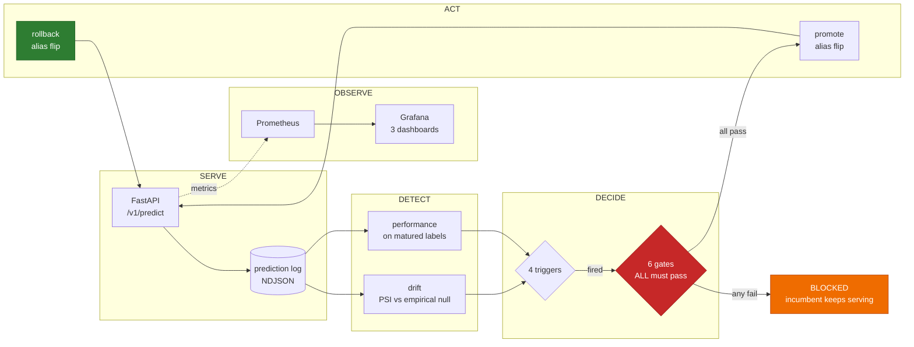

# Hospital Readmission Risk — A Production ML Service

> ## ⚠️ NOT FOR CLINICAL USE
>
> This is an **engineering demonstration of ML operations**, not a medical
> device and not a clinical decision support tool. It is trained on a public
> 1999–2008 hospital research dataset, has never been clinically validated, and
> must never be used to inform patient care. Predictions it returns are
> illustrative of a monitoring and deployment pipeline — nothing more.
>
> This disclaimer appears in the API responses, the model card, and the UI as
> well as here. That repetition is deliberate.

---

## What this project is

Most ML portfolios prove someone can *train* a model. This one exists to prove
something scarcer: that the model can be **operated**.

So the priority is inverted on purpose. The model is deliberately boring — a
regularised logistic regression — and the operations are the product:
monitoring, drift detection, calibration, retraining with promotion gates,
canary rollout, tested rollback, and an incident runbook.

A well-operated logistic regression is a better artifact than an unmonitored
gradient-boosted ensemble. Any effort that would go into squeezing out accuracy
points goes into the observability and retraining layers instead.

### Why hospital readmission, and why this dataset

The widely-circulated symptom-to-disease datasets are synthetically generated
and trivially separable — a decision tree reaches near-100% accuracy on them,
which is a red flag rather than a result.

This project uses **Diabetes 130-US Hospitals (UCI #296)**: 101,766 real
inpatient encounters across 130 hospitals, 1999–2008. Real missingness, real
class imbalance (~11% positive), real fairness dimensions, and a published
performance ceiling around ROC-AUC 0.65–0.68.

That modest ceiling is a **feature, not a limitation.** A model that cannot be
made excellent is a model that must be carefully operated, which is the entire
point.

### What the audit found

The [data audit](docs/DATA_AUDIT.md) is generated from the code, not written by
hand. Four findings changed the pipeline:

- **A deterministic label leak.** 1,652 expired-discharge encounters contain
  **exactly zero** positive labels — a dead patient cannot be readmitted, so a
  model would learn `died → not readmitted` from the discharge code. Removed.
  Hospice discharges are excluded too, but for a *different* reason: they are
  not deterministic (5.6% positive), so calling them leakage would overstate it.
- **The time proxy holds — verified, not assumed.** This dataset has no
  timestamp column at all. 5 of 8 independent signals shift monotonically across
  `encounter_id`, and rosiglitazone prescribing shows a sharp
  **7.7× discontinuity at the 80th percentile** — the 2007 Avandia safety
  collapse. The ordering reproduces a *dated real-world event*, which is far
  stronger evidence than a trend test. See
  [ADR 0004](docs/DECISIONS/0004-temporal-split-proxy.md).
- **Right-censoring at the tail.** A first encounter can only be labelled
  positive if a later encounter exists in the data. The positive rate collapses
  56% in the final 5% of the ordering — labels are *missing, not negative*. A
  censoring buffer now discards that region before splitting.
- **`payer_code` is time-confounded, not merely missing.** Capture goes from
  100% missing to 14% across the period. Under a chronological split the model
  would learn it as a proxy for *era*. Dropped.

The dataset is not trivially separable: an unconstrained decision tree reaches
**0.519 test ROC-AUC**. On the synthetic symptom-to-disease datasets the same
tree reaches ~100%, which is precisely why those datasets prove nothing.

---

## The operations loop

The model is one box in this diagram. Everything else is the project.



Two asymmetries in that diagram are deliberate:

- **Triggering is permissive; promoting is strict.** Any one trigger starts a
  retrain, but every gate must pass to ship it. Training a model is cheap and
  reversible; serving one is neither.
- **Rollback is ungated.** Promotion passes six checks; rollback passes none. A
  safety mechanism that can be blocked by the checks it exists to escape is not
  a safety mechanism.

---

## What this proves — with evidence, not claims

### A better-ranking model is refused because it calibrates worse

This is the whole thesis in one command. The challenger below has a **higher
PR-AUC** than the incumbent — most promotion pipelines would ship it:

```console
$ uv run mlservice retrain gates --challenger challenger.json --incumbent champion.json

  BLOCKED  --  blocked by: calibration
        pass  performance    PR-AUC 0.1434 >= 0.1184 (incumbent 0.1234 - 0.005 margin)
        FAIL  calibration    Brier ratio 1.1500 > 1.02 AND ECE 0.0800 > 0.05
        pass  subgroup       worst gap -0.2323 vs incumbent -0.2323 (+0.0% relative)
        pass  behavioral     20/20 behavioural tests passed
        pass  operational    artifact loads and matches the serving contract
        pass  data_quality   training data passed its quality checks
```

For a health-adjacent task, a probability you cannot trust cannot support a
decision. If the model says 30% it should be right about 30% of the time — and
when that breaks, everyone downstream who reasoned about the number is wrong in
a way no ranking metric will show.

`promote` then refuses the blocked decision, and the serving alias is untouched.
There is deliberately **no `--force`**: a promote command with a bypass is a
promote command with no gates.

### The rollback path is exercised, not asserted

```console
$ uv run mlservice retrain verify-rollback

        seed      -> 1     alias now: 1
        promote   -> 2     alias now: 2
        rollback  -> 1     alias now: 1
  VERIFIED  alias moved 1 -> 2 and back to 1
```

This runs as a **required CI check** against a real MLflow registry.

It exists in this form because the first version of it passed while proving
nothing: it promoted the version that was *already serving* and reported
`promote 2 → 2, rollback 2 → 2, VERIFIED: True`. The alias never moved. A
verification that cannot fail is decoration — see
[ADR 0008](docs/DECISIONS/0008-promotion-gates-and-rollback.md).

### Drift thresholds are derived from data, not chosen

Arbitrary thresholds are the most common sign that monitoring was copied rather
than reasoned about. Each of the 43 per-feature thresholds here is the **99th
percentile of that feature's PSI between stable training windows**, clamped to
[0.10, 0.25].

So every threshold answers *"why this number?"* with **"because this feature
moved that much between windows we accepted only 1% of the time"** — see
[ADR 0007](docs/DECISIONS/0007-drift-thresholds.md).

---

## Status

**Phases 0–7 of 8 complete.** Phase 8 is the docs and the live endpoint.

| Phase | Scope | State |
|:--|:--|:--|
| 0 | Foundation — config, logging, tooling | ✅ done |
| 1 | Data audit and honest baseline | ✅ done |
| 2 | Model, calibration, subgroups, model card | ✅ done |
| 3 | FastAPI serving + prediction log | ✅ done |
| 4 | Tests, behaviour suite, CI, load test | ✅ done |
| 5 | Prometheus + Grafana observability | ✅ done |
| 6 | Drift detection with calibrated thresholds | ✅ done |
| 7 | Retraining, promotion gates, tested rollback | ✅ done |
| 8 | Ship — runbook, live endpoint, docs | 🚧 in progress |

**262 tests** — unit, contract, behaviour, data-quality, and a rollback cycle
against a real registry. Lint, format, types and a Trivy container scan gate
every PR.

---

## Quickstart

Requires [uv](https://docs.astral.sh/uv/) and Python 3.11 (uv fetches it).

```bash
uv sync                      # create the venv and install
uv run mlservice doctor      # verify the environment is fit to run
uv run mlservice config      # show fully resolved configuration
```

Reproduce the whole pipeline from scratch:

```bash
uv run mlservice data download        # fetch from UCI, verify the checksum
uv run mlservice data audit           # regenerate docs/DATA_AUDIT.md
uv run mlservice train run            # train, calibrate, evaluate, register
uv run pytest                         # every suite
```

Drive the operations loop:

```bash
uv run mlservice monitor check        # drift on the latest window
uv run mlservice retrain check        # which triggers fired, and on what evidence
uv run mlservice retrain evidence     # assemble what the gates judge
uv run mlservice retrain gates ...    # run all six; exit 1 blocks
uv run mlservice retrain verify-rollback   # exercise a real promote -> rollback
uv run mlservice retrain history      # the audit trail
```

Docker, `kind` and `kubectl` are needed for the serving stack, dashboards and
the rollout demo — see [docs/DEVELOPMENT.md](docs/DEVELOPMENT.md).

---

## Documentation

| Document | What it covers |
|:--|:--|
| [docs/DATA_AUDIT.md](docs/DATA_AUDIT.md) | Leakage hunt, missingness, imbalance, split verification |
| [docs/MODEL_CARD.md](docs/MODEL_CARD.md) | Intended use, **out-of-scope use**, metrics, calibration, subgroups |
| [docs/MONITORING.md](docs/MONITORING.md) | Every metric and threshold, with its derivation |
| [docs/LOAD_TEST_REPORT.md](docs/LOAD_TEST_REPORT.md) | Measured latency profile and where the service breaks |
| [docs/RETRAINING_POLICY.md](docs/RETRAINING_POLICY.md) | Triggers, promotion gates, rollback |
| [docs/RUNBOOK.md](docs/RUNBOOK.md) | Incident response — what to do when it breaks |
| [docs/ARCHITECTURE.md](docs/ARCHITECTURE.md) | System diagram and component responsibilities |
| [docs/DECISIONS/](docs/DECISIONS/) | Architecture decision records |

---

## Responsible ML commitments

These are load-bearing requirements of the project, enforced in code rather
than promised in prose:

- **Calibration is a deployment gate, not a report.** A model that ranks better
  but calibrates worse is *blocked* from production. For anything
  health-adjacent, a probability you cannot trust cannot support a decision —
  see the calibration gate in [`configs/thresholds.yaml`](configs/thresholds.yaml).
- **Subgroup performance is reported openly**, across race, gender and age
  bands, including where the results are unflattering.
- **Drift is labelled honestly.** Where drift is deliberately induced to
  demonstrate detection, the documentation says so plainly rather than implying
  a claim the data cannot support.
- **Thresholds are derived, not chosen.** Every operational number carries a
  provenance tag (`MEASURED`, `DERIVED`, `STANDARD`, `PLACEHOLDER`) and a
  written justification.
- **No patient-level data is ever committed.** See [data/README.md](data/README.md).

---

## Honest limitations

Stated plainly, because a reviewer will find these anyway and finding them
undisclosed is worse than reading them here.

**About the data and model**

- **The temporal split rests on a proxy.** This dataset has no timestamp column.
  `encounter_id` ordering was *verified* rather than assumed — 5 of 8 signals
  shift monotonically, and the 7.7× rosiglitazone discontinuity reproduces the
  2007 Avandia withdrawal — but it remains a proxy, not a date.
- **Single-institution, 1999–2008 data.** Nothing here transfers to a modern
  hospital population without revalidation.
- **The model is modest and meant to be.** PR-AUC 0.123 against a 7.6%
  prevalence, ROC-AUC 0.616. That is near the published ceiling for this task.
  Chasing it higher would invert the point of the project.
- **Subgroup disparities exist and are not fixed.** The worst recall gap is
  -0.232. The subgroup gate prevents it *widening*; it does not claim fairness.
  The [model card](docs/MODEL_CARD.md) reports every group.
- **No clinical validation of any kind.** See the disclaimer at the top.

**About what has and has not been run**

| Claim | Status |
|:--|:--|
| Promotion gates block a bad model | ✅ demonstrated on the real champion |
| Model rollback (registry alias flip) | ✅ verified in CI against a real registry |
| Drift detection on real and induced drift | ✅ both, with `drift_origin` labelled |
| Latency profile | ⚠️ measured, but load generator was co-located — `remeasure_required: true` |
| Canary rollout | ❌ configured, **never exercised** |
| `kubectl rollout undo` | ❌ manifests and script written, **never run** |
| Live public endpoint | ❌ **not deployed** — image, Space config and deploy workflow are written and the payload dry-runs clean; no HF token is configured, so it has never run |
| End-to-end unattended retrain | ❌ triggers fire correctly on real evidence; the full loop has not run alone |

The three ❌ items in the lower half share one cause: **Docker is not installed
on the development machine.** Rather than pretend otherwise, every affected
document carries its own "not verified" section, and
`scripts/k8s_rollback_demo.sh` says `STATUS: written, NOT run` in its header.

**Deploying the live endpoint.** Everything is in place except the credential:
[`deploy/docker/Dockerfile.hf`](deploy/docker/Dockerfile.hf),
[`deploy/hf-space/README.md`](deploy/hf-space/README.md) and
[`.github/workflows/deploy-hf.yml`](.github/workflows/deploy-hf.yml). Add an HF
write token as the `HF_TOKEN` repository secret, push the trained artifact to an
HF Model repo, and dispatch the workflow. The model binary reaches the Space by
download at startup and never enters git — the same artifact-store/runtime split
the MLflow path uses.

**Induced vs real drift.** Where drift is deliberately induced to demonstrate
detection, every report carries `drift_origin: induced` and the docs say so. The
genuine 1999→2008 shift in medication mix and specialty recording is labelled
`real`. The two are never conflated.

---

## Data handling

The UCI dataset is public and de-identified, but this repository still never
commits row-level records, model binaries, or MLflow artifact stores. Data is
fetched by script and verified against `data/checksums.txt`, which keeps the
pipeline reproducible without putting clinical records in git history.

---

## Licence

[MIT](LICENSE). The dataset carries its own terms — see [data/README.md](data/README.md).
