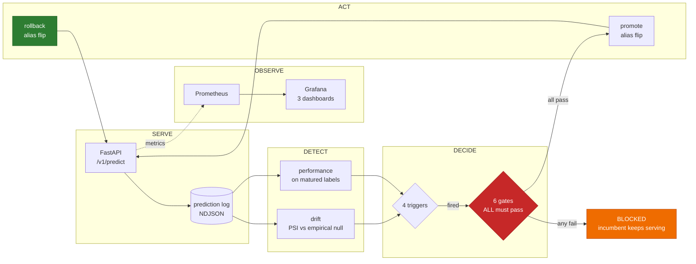

# Credit Default Risk — A Production ML Service

> ## ⚠️ NOT A CREDIT DECISIONING SYSTEM
>
> This is an **engineering demonstration of ML operations**. It is trained on a
> public 2007–2015 dataset from a single lender, has never been validated for
> lending, and has had **no fair-lending or disparate-impact review**. It must
> never be used to decide anyone's access to credit or the price of it.
>
> This disclaimer appears in every API response, the model card and the UI as
> well as here. That repetition is deliberate.

---

## What this project is

Most ML portfolios prove someone can *train* a model. This one exists to prove
something scarcer: that the model can be **operated**.

So the priority is inverted on purpose. The model is deliberately boring — a
calibrated logistic regression — and the operations are the product:
monitoring, drift detection, calibration-gated retraining, canary rollout,
tested rollback, and an incident runbook.

A well-operated logistic regression is a better artifact than an unmonitored
gradient-boosted ensemble. Any effort that would go into squeezing out accuracy
points goes into the observability and retraining layers instead.

### Why credit default

One requirement decided the domain. The project's central control is a
promotion gate that **blocks a challenger which ranks better but calibrates
worse**. That argument only has force where someone acts on the probability
*as a number* — and in credit, the probability is literally the price:

> expected loss = probability of default × exposure × loss given default

A miscalibrated probability is a mispriced loan. The calibration gate stops
being an ethical nicety and becomes the thing protecting the business.

**Lending Club's accepted-loan book:** 2,260,701 loans issued 2007–2018, cut to
**672,379 matured loans, 2007-06 to 2015-12**, with a **14.8%** default rate. It
is real, messy, genuinely imbalanced, and modestly predictable — ROC-AUC near
0.70 is close to the published range for this task. See
[ADR 0003](docs/DECISIONS/0003-dataset-selection.md) for the datasets rejected
and why.

### What the audit found

The [data audit](docs/DATA_AUDIT.md) is generated from code, not written by
hand. Five findings changed the pipeline, and each is a number rather than a
claim:

- **A deterministic leak, demonstrated.** Thirty-one columns are knowable only
  after a loan has run. Training on them reaches **ROC-AUC 0.9983** against an
  honest ceiling near 0.70. Of the 80,312 loans with `recoveries > 0`,
  **100.00%** are defaults — recoveries is money clawed back *after* a default,
  so a non-zero value *is* the label. These columns look like ordinary loan
  attributes, which is exactly why they are dangerous.
- **Right-censoring dominates the recent years.** 40.4% of loans are
  unresolved (38.9% still Current, the rest late or in grace), and the resolved fraction collapses from 100% (2007–2013) to 11.4%
  (2018). The 2018 default rate also *falls* — survivorship among fast
  resolvers, not better lending. Requiring the full term to have elapsed moves
  the positive rate from **0.1998 to 0.1481**: skipping it overstates default
  by 35% relative.
- **The label leaked back in as a feature.** `loan_status` is the column the
  target is derived from, so it predicts it perfectly. It survived the first
  pass because the data dictionary calls it a loan attribute — which it is,
  right up until you make it the label. *Deriving a target creates a leak that
  did not exist before.*
- **33 rows are not loans.** The file ends in export footers — text like
  `"Total amount funded in policy code 1: 6417608175"` sitting in the `id`
  column with every other field empty. They are now removed by a rule that
  names them, rather than vanishing incidentally into the label filter.
- **The problem is genuinely hard.** An unconstrained decision tree, 66 deep
  with 45,210 leaves, scores **1.000 on train and 0.5335 on test**. It memorises
  everything and generalises almost nothing.

---

## The operations loop

The model is one box in this diagram. Everything else is the project.



Two asymmetries in that diagram are deliberate:

- **Triggering is permissive; promoting is strict.** Any one trigger starts a
  retrain, but every gate must pass to ship it. Training a model is cheap and
  reversible; serving one is neither.
- **Rollback is ungated.** Promotion passes six checks; rollback passes none. A
  safety mechanism that can be blocked by the checks it exists to escape is not
  a safety mechanism.

---

## What this proves — with evidence, not claims

### A better-ranking model is refused because it calibrates worse

This is the whole thesis in one command. The challenger below has a **higher
PR-AUC** than the incumbent — most promotion pipelines would ship it:

```console
$ uv run mlservice retrain gates --challenger challenger.json --incumbent champion.json

  BLOCKED  --  blocked by: calibration
        pass  performance    PR-AUC 0.2923 >= 0.2673 (incumbent 0.2723 - 0.005 margin)
        FAIL  calibration    Brier ratio 1.1501 > 1.02 AND ECE 0.0800 > 0.05
        pass  subgroup       worst gap -0.2926 vs incumbent -0.2926 (+0.0% relative, limit +20%)
        pass  behavioral     25/25 behavioural tests passed
        pass  operational    artifact loads and matches the serving contract
        pass  data_quality   training data passed its quality checks
```

A lender prices loans off the probability. A model that ranks borrowers better
but systematically misstates *how likely* each is to default misprices every
loan it touches — while every ranking metric improves.

`promote` then refuses the blocked decision and the serving alias is untouched.
There is deliberately **no `--force`**: a promote command with a bypass is a
promote command with no gates.

### It beats the lender — narrowly, and that is stated

The strongest baseline is not a strawman. `int_rate` is the price Lending Club
set *after running its own underwriting model*, so ranking by it asks whether
this model beats the incumbent lender's judgment:

| | PR-AUC | 95% CI |
|:--|--:|:--|
| Prevalence floor | 0.1471 | — |
| `int_rate` — the lender's own priced risk | 0.2529 | [0.2486, 0.2575] |
| **Champion** | **0.2723** | **[0.2676, 0.2769]** |

Non-overlapping intervals, so the win is real. It is also **0.019** — and part
of the champion's skill is the lender's, because their grade carries the two
largest coefficients in the model. See
[ADR 0009](docs/DECISIONS/0009-lender-grade-as-a-feature.md).

### The fairness finding is in the coefficients, not the footnotes

Four of the ten largest coefficients are `addr_state` dummies. The worst
subgroup recall gap — **−0.293, New Hampshire** — therefore falls on a feature
the model structurally relies on. Geographic risk pricing is exactly the terrain
fair-lending law governs, because location correlates with the protected
characteristics this data deliberately omits.

This model has had no disparate-impact review. The [model card](docs/MODEL_CARD.md)
says so in its fairness section, reports all 59 analysable subgroups, and does
not soften any of them.

### The rollback path is exercised, not asserted

```console
$ uv run mlservice retrain verify-rollback

        seed      -> 1     alias now: 1
        promote   -> 2     alias now: 2
        rollback  -> 1     alias now: 1
  VERIFIED  alias moved 1 -> 2 and back to 1
```

A **required CI check** against a real MLflow registry. It exists in this form
because its first version passed while proving nothing — it promoted the version
already serving and reported `promote 2 → 2, VERIFIED: True`. A verification
that cannot fail is decoration. See
[ADR 0008](docs/DECISIONS/0008-promotion-gates-and-rollback.md).

### Drift thresholds are measured, and they found something

Each of the 64 per-feature thresholds is the **99th percentile of that feature's
PSI between consecutive stable training windows**, clamped to [0.10, 0.25].

That calibration produced a finding. Three features hit the ceiling:

| Feature | Measured p99 churn |
|:--|--:|
| `initial_list_status` | 0.638 |
| `term` | 0.563 |
| `int_rate` | 0.416 |

**None of them is a borrower attribute. They are the lender's own policy
levers** — how a loan was listed, what terms were offered, how it was priced —
and they churn enormously between windows accepted as stable, because Lending
Club kept changing its product. Meanwhile 57 of 64 borrower features sit on the
floor, almost motionless. A generic 0.2 threshold would page constantly on
`int_rate` while missing real movement everywhere else. See
[ADR 0007](docs/DECISIONS/0007-drift-thresholds.md).

---

## Status

**Complete.** All eight phases, with every claim in the verification table
below executed and observed rather than assumed.

**282 tests** — 207 unit, 29 contract, 25 behaviour, 21 data-quality — plus a
rollback cycle against a real registry. Lint, format, types and a Trivy
container scan gate every pull request.

---

## Quickstart

Requires [uv](https://docs.astral.sh/uv/) and Python 3.11 (uv fetches it).

```bash
uv sync                      # create the venv and install
uv run mlservice doctor      # verify the environment is fit to run
uv run mlservice config      # show fully resolved configuration
```

Reproduce the whole pipeline from scratch:

```bash
uv run mlservice data download        # fetch 1.6 GB, verify the SHA256
uv run mlservice data audit           # regenerate docs/DATA_AUDIT.md
uv run mlservice train run            # train, calibrate, evaluate, register
uv run pytest                         # every suite
```

Drive the operations loop:

```bash
uv run mlservice monitor check             # drift on the latest window
uv run mlservice retrain check             # which triggers fired, and on what evidence
uv run mlservice retrain evidence          # assemble what the gates judge
uv run mlservice retrain gates ...         # run all six; exit 1 blocks
uv run mlservice retrain verify-rollback   # exercise a real promote -> rollback
uv run mlservice retrain history           # the audit trail
```

Docker, `kind` and `kubectl` are needed for the serving stack, dashboards and
the rollout demo — see [docs/DEVELOPMENT.md](docs/DEVELOPMENT.md).

---

## Documentation

| Document | What it covers |
|:--|:--|
| [docs/DATA_AUDIT.md](docs/DATA_AUDIT.md) | Leakage, censoring, missingness, imbalance, the split — generated from code |
| [docs/MODEL_CARD.md](docs/MODEL_CARD.md) | Intended use, **out-of-scope use**, metrics, calibration, subgroups |
| [docs/MONITORING.md](docs/MONITORING.md) | Every metric and threshold, with its derivation |
| [docs/LOAD_TEST_REPORT.md](docs/LOAD_TEST_REPORT.md) | Measured latency profile and where the service breaks |
| [docs/RETRAINING_POLICY.md](docs/RETRAINING_POLICY.md) | Triggers, promotion gates, rollback |
| [docs/RUNBOOK.md](docs/RUNBOOK.md) | Incident response — what to do when it breaks |
| [docs/K8S_ROLLBACK_DEMO.md](docs/K8S_ROLLBACK_DEMO.md) | Captured output from a real rollout failure, rollback and canary |
| [docs/ARCHITECTURE.md](docs/ARCHITECTURE.md) | System diagram and component responsibilities |
| [docs/DECISIONS/](docs/DECISIONS/) | Nine architecture decision records |

---

## Responsible ML commitments

Load-bearing requirements, enforced in code rather than promised in prose:

- **Calibration is a deployment gate, not a report.** A model that ranks better
  but calibrates worse is *blocked* from production, because in credit the
  probability is the price.
- **Subgroup performance is reported openly** across state, income band,
  employment length and home ownership — the geographic and socioeconomic
  proxies fair-lending analysis actually uses, since US credit data legally
  excludes race and gender. Including where the results are unflattering.
- **The same threshold applies to every group.** Per-group thresholds would
  improve the numbers and would be disparate treatment — the thing the analysis
  exists to detect, not to implement.
- **Drift is labelled honestly.** Induced drift in the demo carries
  `drift_origin: induced`; the genuine 2007–2015 shift carries `real`.
- **Thresholds are derived, not chosen.** Every operational number carries a
  provenance tag and a written justification.
- **Sensitive fields never reach application logs.** Identifiers,
  quasi-identifiers like `emp_title` and `zip_code`, and `annual_inc` are
  redacted — verified with a positive control, not assumed.
- **No borrower-level data is committed.** See [data/README.md](data/README.md).

---

## Honest limitations

Stated plainly, because a reviewer will find these anyway and finding them
undisclosed is worse than reading them here.

**About the data and model**

- **Repeat borrowers cannot be excluded.** `member_id` is null for every row, so
  the same person may appear in both train and test. Deduplicating by borrower is
  the standard defence and it is simply unavailable; held-out metrics are
  inflated to whatever extent repeat borrowing occurs.
- **The model inherits the lender's judgment.** Lending Club's own grade carries
  the two largest coefficients. The model beats their pricing by 0.019 PR-AUC —
  real, narrow, and partly theirs.
- **No fair-lending review has been done.** Geography is a top-ten signal and the
  worst subgroup gap falls on a state. That work would be mandatory before any
  real use.
- **Training is dominated by two years.** 2013–2014 are 43.7% of all loans;
  2007–2011 only 6.4%. The model knows little about crisis-era lending.
- **One platform, 2007–2015, US unsecured personal loans only.** It does not
  transfer to another lender, whose grades mean something different or do not
  exist.
- **Provenance rests on a mirror.** Lending Club withdrew the official download.
  The SHA256 makes that acceptable — a changed mirror fails loudly — but the
  original source is gone.

**About what has and has not been run**

| Claim | Status |
|:--|:--|
| Promotion gates block a bad model | ✅ demonstrated on the credit champion |
| Model rollback (registry alias flip) | ✅ verified in CI against a real registry |
| Container actually serves predictions | ✅ verified end-to-end; regression-tested in CI |
| The UI's own payload validates | ✅ replicated the page's JavaScript against the real API |
| End-to-end unattended retrain | ✅ ran in CI — retrained, gated, rollback verified |
| Latency profile | ⚠️ measured, but the load generator was co-located — `remeasure_required: true` |

---

## Data handling

The dataset is public, but this repository still never commits borrower-level
records, model binaries, or MLflow artifact stores. Data is fetched by script
and verified against `data/checksums.txt`. The model artifact lives in a
separate Hugging Face Model repo and is downloaded at boot, so the binary never
enters git — the same artifact-store/runtime split the MLflow path uses.

---

## Licence

[MIT](LICENSE). The dataset carries its own terms — see
[data/README.md](data/README.md).
