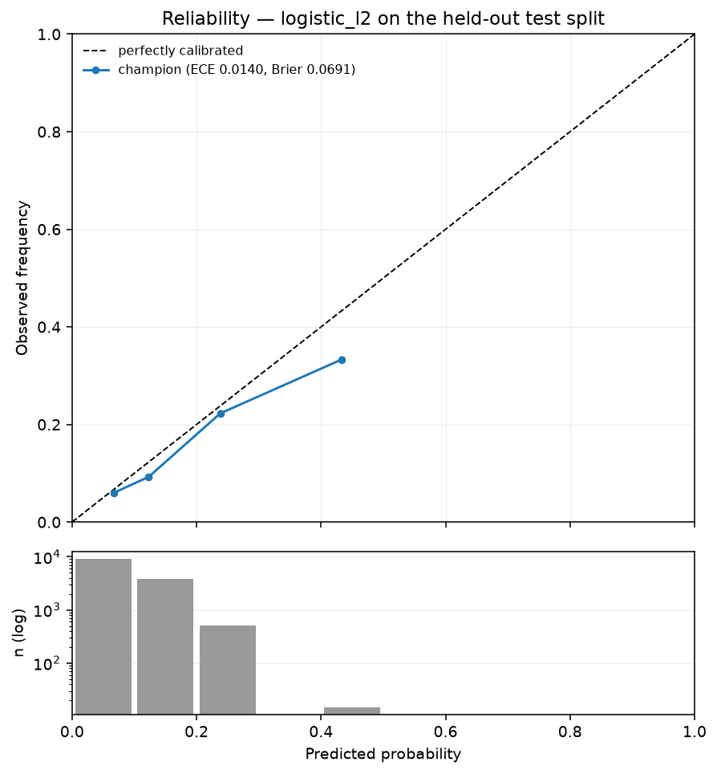

# Model Card — Hospital Readmission Risk

> ## NOT FOR CLINICAL USE
>
> This model is an **engineering demonstration of ML operations**. It is
> not a medical device, has never been clinically validated, and must
> never inform patient care. It is trained on a public 1999–2008 research
> dataset that does not reflect current clinical practice.
> Generated by `uv run mlservice train run` from `reports/training_summary.json`. Do not edit by hand — regenerate it.
---

## Model details

| | |
|:--|:--|
| Name | `readmission-risk` |
| Version | 2 |
| Type | logistic_l2 — regularised logistic regression |
| Calibration | isotonic, fitted on validation |
| Decision threshold | 0.1011 |
| Feature schema hash | `06f5f0b873ca95f6` |
| Training rows | 39,894 |
| Licence | MIT (code); CC BY 4.0 (data) |

## Intended use

**Intended:** demonstrating a production ML lifecycle — serving, monitoring, drift detection, calibration-gated retraining and rollback. The model exists so that there is something real to operate.

### Out-of-scope use

Stated at equal prominence because it is the more important half:

- **Any clinical decision.** Not validated, not a device, not lawful to use as one.
- **Individual patient risk communication.** At the operating threshold 89.1% of flagged patients are not readmitted within 30 days.
- **Resource allocation or triage.** The subgroup disparities below make this actively harmful.
- **Any population outside the training distribution** — US inpatient diabetes encounters, 1999–2008, 1–14 day stays.
- **Transfer to current practice.** Diabetes care has changed substantially since 2008; the audit detected the 2007 rosiglitazone withdrawal *inside* the training period.

## Training data

Diabetes 130-US Hospitals (UCI #296) — 101,766 encounters across 130 hospitals, 1999–2008. After cleaning: 69,990 rows (31.22% removed).
Exclusions and their reasons are in [DATA_AUDIT.md](DATA_AUDIT.md). The load-bearing ones:

- **Expired discharges removed** — 1,652 encounters with exactly zero positive labels. A deterministic leak.
- **First encounter per patient only** — otherwise the same patient appears on both sides of the split.
- **`payer_code` dropped** — time-confounded, not merely missing.
- **Final 5% of the ordering dropped** — right-censoring makes those labels missing rather than negative.
**Split:** 39,894 train / 13,298 validation / 13,298 test, chronological on a verified `encounter_id` proxy ([ADR 0004](DECISIONS/0004-temporal-split-proxy.md)). **No timestamps exist in this dataset**; the ordering is a proxy that was tested before being trusted.

## Performance

PR-AUC is the headline. At a 7.57% positive rate ROC-AUC is dominated by the large negative class and moves without changing what happens to the patients who are actually readmitted.

| Metric | Value | 95% CI |
|:--|--:|:--|
| **PR-AUC** | **0.1234** | [0.1110, 0.1375] |
| ROC-AUC | 0.6162 | [0.5981, 0.6345] |
| Brier | 0.0691 | [0.0658, 0.0726] |
| ECE (10 bins) | 0.0140 | — |
| MCE (worst bin) | 0.1000 | — |

### Against the baselines it must beat

| Model | PR-AUC | 95% CI |
|:--|--:|:--|
| Prevalence floor | 0.0757 | — |
| `number_inpatient` heuristic | 0.0862 | [0.0796, 0.0959] |
| **This model** | **0.1234** | [0.1110, 0.1375] |

The intervals **do not overlap**, so the model has demonstrably beaten a one-feature heuristic available at admission with no model at all. That was the bar for justifying the serving, monitoring and retraining infrastructure.
For contrast, the majority-class baseline scores **92.4% accuracy with 0% recall.** This is why accuracy is not reported as a headline metric.

## Operating point, stated honestly

The threshold (0.1011) was chosen **on validation** to reach 50.0% recall. On the held-out test split:

| | |
|:--|--:|
| Recall | 0.465 |
| Precision | 0.109 |
| Patients flagged | 32.3% |
| Lift over prevalence | 1.442× |
| True positives | 468 |
| False positives | 3,821 |
| False negatives | 538 |

**Read those numbers plainly.** To catch 47% of readmissions the model flags 32.3% of all patients, and 89.1% of those flags are wrong. It produces 3,821 false alarms for 468 true ones. That is the real trade-off at this prevalence, and no threshold choice escapes it — it is a property of the problem, not a defect of the model.
Recall on test (0.465) also fell short of the validation target (0.507). A threshold tuned on one time period does not transfer perfectly to the next — which is precisely the behaviour the monitoring in Phase 6 exists to detect.

## Calibration

Calibration is a **deployment gate** in this project, not a report ([ADR 0002](DECISIONS/0002-calibration-as-deployment-gate.md)). A challenger that ranks better but calibrates worse is blocked.

| | Value | Gate | Status |
|:--|--:|--:|:--|
| ECE (10 bins) | 0.0140 | ≤ 0.05 | PASS |
| Brier | 0.0691 | — | — |
| MCE (worst bin) | 0.1000 | — | reported, not gated |

MCE is reported alongside ECE because they can disagree sharply, and a single number would hide it.

In this run `random_forest_shallow` held the **best** ECE (0.0139) *and* the **worst** MCE (0.8000) — one probability bin was badly wrong while the count-weighted average looked healthy.

## Subgroup performance

Reported for every subgroup above n=500, **including where the results are unflattering.** Selective reporting would be worse than no fairness analysis, because it implies a check that was not really performed.
The same threshold is applied to every group. Per-group thresholds would improve these numbers and would mean treating patients differently by demographics — the thing this analysis exists to detect, not to implement.

### `race`

| Group | n | Positives | Recall | Precision | Gap vs overall | Analysed |
|:--|--:|--:|--:|--:|--:|:--:|
| Caucasian | 10,428 | 805 | 0.478 | 0.112 | +0.013 | yes |
| AfricanAmerican | 1,624 | 119 | 0.311 | 0.084 | -0.154 | yes |
| Unknown | 523 | 33 | 0.545 | 0.078 | +0.080 | yes |
| Hispanic | 340 | 23 | 0.522 | 0.145 | +0.057 | **no — n too small** |
| Other | 255 | 13 | 0.615 | 0.138 | +0.150 | **no — n too small** |
| Asian | 128 | 13 | 0.615 | 0.229 | +0.150 | **no — n too small** |

### `gender`

| Group | n | Positives | Recall | Precision | Gap vs overall | Analysed |
|:--|--:|--:|--:|--:|--:|:--:|
| Female | 6,916 | 511 | 0.479 | 0.106 | +0.014 | yes |
| Male | 6,380 | 495 | 0.451 | 0.113 | -0.015 | yes |
| Unknown/Invalid | 2 | 0 | 0.000 | 0.000 | +0.000 | **no — n too small** |

### `age`

| Group | n | Positives | Recall | Precision | Gap vs overall | Analysed |
|:--|--:|--:|--:|--:|--:|:--:|
| [70-80) | 3,223 | 274 | 0.533 | 0.112 | +0.068 | yes |
| [60-70) | 3,141 | 242 | 0.430 | 0.109 | -0.035 | yes |
| [50-60) | 2,304 | 151 | 0.285 | 0.120 | -0.180 | yes |
| [80-90) | 2,277 | 185 | 0.692 | 0.105 | +0.227 | yes |
| [40-50) | 1,253 | 73 | 0.233 | 0.085 | -0.232 | yes |
| [30-40) | 469 | 27 | 0.481 | 0.178 | +0.016 | **no — n too small** |
| [90-100) | 362 | 36 | 0.333 | 0.079 | -0.132 | **no — n too small** |
| [20-30) | 202 | 14 | 0.357 | 0.179 | -0.108 | **no — n too small** |
| [10-20) | 62 | 4 | 0.000 | 0.000 | -0.465 | **no — n too small** |
| [0-10) | 5 | 0 | 0.000 | 0.000 | +0.000 | **no — n too small** |

### The disparities, stated without softening

**`race`.** Recall runs from **0.311** (AfricanAmerican, n=1,624) to **0.545** (Unknown, n=523) — a spread of 23.5 percentage points across subgroups large enough to analyse. The model misses a substantially larger share of readmissions in the lower group.
**`gender`.** Recall runs from **0.451** (Male, n=6,380) to **0.479** (Female, n=6,916) — a spread of 2.9 percentage points across subgroups large enough to analyse. The gap here is small relative to the other dimensions.
**`age`.** Recall runs from **0.233** ([40-50), n=1,253) to **0.692** ([80-90), n=2,277) — a spread of 45.9 percentage points across subgroups large enough to analyse. The model is markedly better at identifying at-risk older patients than middle-aged ones.
**A plausible mechanism, not a proven one.** The strongest features are prior-utilisation counts. Any group whose earlier care was delivered outside this hospital network, or recorded less completely, carries artificially low prior-utilisation values and is therefore systematically under-flagged. If that is the mechanism, the disparity originates in the data-generating process — which means it would not be fixed by reweighting the model, and could be made invisible rather than absent by doing so.
**Worst analysable gap: -0.232 (age=[40-50)).** The Phase 7 promotion gate blocks any challenger that widens this by more than 20% relative — the gate is anchored to the incumbent because no absolute fairness constant would be defensible on this data, and inventing one implies a guarantee the evaluation cannot support.

## Limitations

- **No timestamps exist.** The chronological split rests on an
  `encounter_id` proxy, verified but still a proxy.
- **A positive-rate gradient survives the censoring buffer** (9.87% train → 7.56% test). Part real shift, part residual censoring; they cannot be separated without dates.
- **Modest discrimination by design.** The published ceiling is ROC-AUC 0.65–0.68. This project treats a well-operated modest model as the goal.
- **Single-network, 1999–2008, US inpatient diabetes encounters only.**
- **Documented subgroup disparities** that are not mitigated in the model, only measured and gated against worsening.
- **Prior-utilisation dependence** makes the model sensitive to record completeness, which is itself unevenly distributed.

## How this model was selected

**Rule:** simplest candidate statistically indistinguishable from the best.

| Candidate | PR-AUC | 95% CI | ECE | Chosen |
|:--|--:|:--|--:|:--:|
| baseline_prevalence | 0.0756 | [0.0716, 0.0799] | 0.0231 |  |
| logistic_l2 | 0.1234 | [0.1110, 0.1375] | 0.0140 | **yes** |
| logistic_l2_strong | 0.1220 | [0.1098, 0.1355] | 0.0143 |  |
| random_forest_shallow | 0.1147 | [0.1037, 0.1268] | 0.0139 |  |

highest point estimate and simplest among indistinguishable candidates
**XGBoost was not tried.** It was admitted only on audit evidence of non-linear structure worth the operational cost, and the audit produced the opposite: an unconstrained decision tree — able to represent arbitrary interactions — reached 0.519 test ROC-AUC. The shallow random forest here likewise failed to beat logistic regression. There is no unexploited non-linear signal to buy. See [ADR 0005](DECISIONS/0005-model-selection.md).

## Citation

> Strack, B., DeShazo, J.P., Gennings, C., Olmo, J.L., Ventura, S.,
> Cios, K.J., Clore, J.N. (2014). *Impact of HbA1c Measurement on
> Hospital Readmission Rates.* BioMed Research International.
